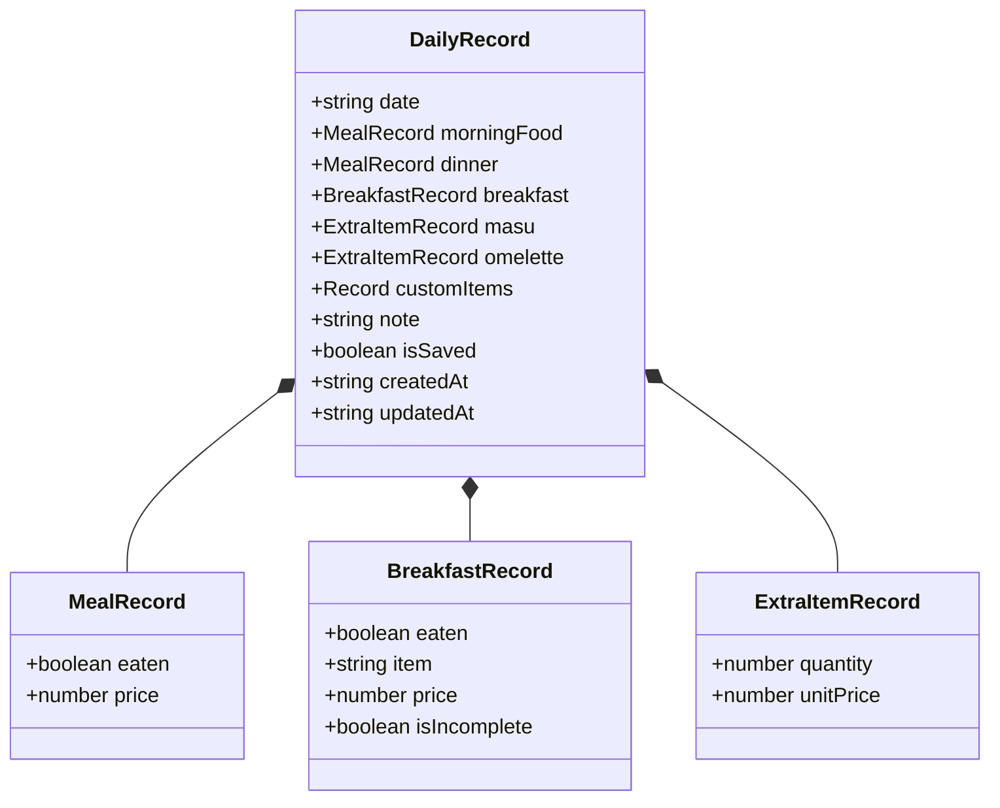
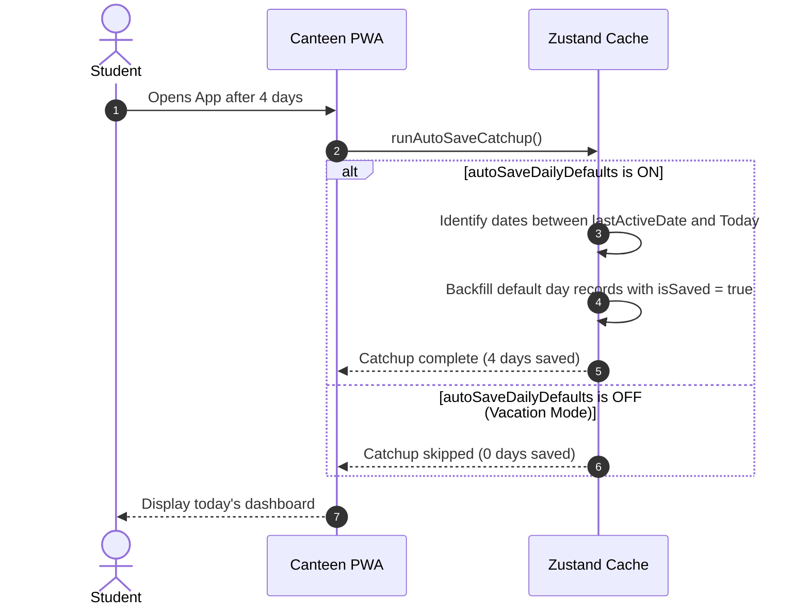

# 🍱 WRC Hostel Canteen Tracker — Master Architecture & Implementation Ledger 💖🇳🇵

<div align="center">

[](https://github.com/jagdishsah126/Canteen)
[](https://canteen-wrc.vercel.app/)
[-orange?style=for-the-badge)](https://canteen-wrc.vercel.app/)
[](https://canteen-wrc.vercel.app/)

*“A robust, zero-drift, client-side ledger engineered for the hostel scholars of Paschimanchal Campus (WRC), IOE, Pokhara.”* 🏔️🍲

</div>

---

## 📑 Interactive Table of Contents

- [🎯 1. Project Goal & Core Philosophy](#1-project-goal--core-philosophy)
- [🔄 2. Schema Evolution History (v1 ➔ v5)](#2-schema-evolution-history-v1--v5)
- [🧠 3. Foundational Architectural Principles](#3-foundational-architectural-principles)
- [🍱 4. Food & Billing Data Model](#4-food--billing-data-model)
- [⚙️ 5. Modular Custom Items & Removability Engine](#5-modular-custom-items--removability-engine)
- [⚡ 6. Auto-Save Catchup & Vacation Mode](#6-auto-save-catchup--vacation-mode)
- [📝 7. Day Notes & Resident Profile](#7-day-notes--resident-profile)
- [📊 8. Monthly Analytics & Dynamic Badges Engine](#8-monthly-analytics--dynamic-badges-engine)
- [🔔 9. Offline Local Browser Reminders](#9-offline-local-browser-reminders)
- [🛡️ 10. Security, Backup & Migration Pipeline](#10-security-backup--migration-pipeline)
- [🧪 11. Verification Matrix & Test Suites](#11-verification-matrix--test-suites)

---

## 1. Project Goal & Core Philosophy

<details open>
<summary><b>🌟 Purpose & Boundaries</b></summary>

The primary objective of **WRC Hostel Canteen Tracker** is to provide an infallible, mobile-first, 100% offline personal accounting tool for hostel residents to:
1. Record everyday canteen meal consumption without manual notebook arithmetic.
2. Align seamlessly with the Nepali **Bikram Sambat (BS)** calendar used by the hostel mess management.
3. Automatically audit and verify monthly bills against the contractor's posted notice board sheets.
4. Prevent billing disputes caused by skipped meals, outside eating, or extra add-ons.

> 🔒 **Absolute Boundary**: No external backend, no accounts, no authentication passwords, and no cloud databases. The student's device is the sovereign store of their data.

</details>

---

## 2. Schema Evolution History (v1 ➔ v5)

The database schema is versioned sequentially with automated forward-migration handlers:

```
[ Schema v1 ] ──▶ Core Meals (Lunch, Dinner, Breakfast, Masu, Omelette)
      │
      ▼
[ Schema v2 ] ──▶ Month Snapshots & Discrepancy Auditing
      │
      ▼
[ Schema v3 ] ──▶ Custom Options Engine (Toggle, Numeric Steppers)
      │
      ▼
[ Schema v4 ] ──▶ Multi-Choice Presets, Auto-Save Engine & Removable Core Meals
      │
      ▼
[ Schema v5 ] ──▶ Resident Profile, Day Notes, Food Analytics & Offline Reminders 🚀
```

<details>
<summary><b>📜 Schema Version Breakdown Table</b></summary>

| Version | Key Innovations | Persistence Key |
| :--- | :--- | :--- |
| **v1** | Baseline DailyRecord with Morning Food, Dinner, Breakfast object, Masu & Omelette steppers. | `wrc_hostel_canteen_store_v1` |
| **v2** | Added `MonthSnapshot` frozen receipts for closing months and detecting edits. | `wrc_hostel_canteen_store_v2` |
| **v3** | Introduced `customOptions` registry allowing students to define custom items. | `wrc_hostel_canteen_store_v3` |
| **v4** | Added `multi_choice` custom presets, `coreItemsEnabled` toggles, and `autoSaveDailyDefaults`. | `wrc_hostel_canteen_store_v4` |
| **v5** | Added `userProfile` (Name/Room/Block), `note` field per record, `showDailyNotes`, `showFoodAnalytics`, and `reminderConfig`. | `wrc_hostel_canteen_store_v5` |

</details>

---

## 3. Foundational Architectural Principles

1. **The Daily Record is the Sovereign Source of Truth**:
   - Calculated costs are derived on the fly via pure functions (`calculateDailyCost`).
   - Changing future meal prices in Settings **never** retroactively mutates past recorded bills.
2. **Date Decoupling**:
   - Internal storage keys strictly use standard ISO `YYYY-MM-DD` strings.
   - Presentation dynamically maps ISO strings to Bikram Sambat (`nepali-date-converter`).
3. **Non-Destructive Draft Navigation**:
   - Browsing historical or future dates creates transient draft state.
   - Records are only saved if the user explicitly taps **✓ Save Day** (or for today when Auto-Save is active).

---

## 4. Food & Billing Data Model



---

## 5. Modular Custom Items & Removability Engine

Hostel students have varied dietary habits. The app provides two layers of modularity:

1. **Removable Core Meals (`coreItemsEnabled`)**:
   - Any core meal (*Morning Food, Breakfast, Dinner, Masu, Omelette*) can be toggled OFF in Settings.
   - When toggled off, it disappears from the Daily Feed and default records to keep the interface minimal.
2. **Infinite Custom Items (`customOptions`)**:
   - **Toggle (`toggle`)**: Single switch (e.g. *Hostel Milk: Rs. 35*).
   - **Quantity Stepper (`quantity`)**: Non-negative counter (e.g. *Boiled Eggs: Rs. 20/piece*).
   - **Multi-Choice Presets (`multi_choice`)**: Grouped options (e.g. *Afternoon Canteen Snacks* with presets: *Samosa Rs. 35*, *Pakoda Rs. 40*, *Puri Tarkari Rs. 60*).

---

## 6. Auto-Save Catchup & Vacation Mode



- **Auto-Save ON**: Zero manual effort on standard days.
- **Vacation Mode (Auto-Save OFF)**: Turn off before leaving for semester breaks or holidays; prevents phantom charges during leave!

---

## 7. Day Notes & Resident Profile

### 📝 Day Notes (Diary)
- Added directly to `DailyRecord.note` (maximum 120 characters).
- Preserves raw typing without aggressive real-time whitespace stripping.
- Appears on the Home screen card and within the Monthly Summary expandable audit trail.
- Can be globally hidden via Settings toggle (`showDailyNotes`).

### 👤 Resident Profile
- Configured in Settings:
  - `name`: Student's name (e.g. *Jagdish Sah*).
  - `roomNumber`: Hostel room number (e.g. *214*).
  - `hostelBlock`: Hostel wing/block (e.g. *Block B*).
  - `showBadgeOnHome`: Toggle badge visibility.
- Renders as a top header chip on the Home screen and headers the Monthly Bill summary.

---

## 8. Monthly Analytics & Dynamic Badges Engine

Implemented in `src/utils/analytics.ts` via `calculateMonthlyAnalytics`:

### 📊 Financial & Consumption Analytics
- Total expense & active attendance days count.
- Multi-segment spend breakdown percentage:
  $$\text{Morning \%} = \frac{\text{Morning Cost}}{\text{Total Cost}} \times 100$$
  $$\text{Dinner \%} = \frac{\text{Dinner Cost}}{\text{Total Cost}} \times 100$$
  $$\text{Breakfast \%} = \frac{\text{Breakfast Cost}}{\text{Total Cost}} \times 100$$
  $$\text{Extras \%} = 100 - (\text{Morning \%} + \text{Dinner \%} + \text{Breakfast \%})$$
- Average daily meal cost & highest spending day record.

### 🏆 Unlockable Hostel Badges
| Badge | Title | Requirement |
| :---: | :--- | :--- |
| 🍗 | **Masu Lover** | Recorded non-veg chicken/buff 4+ times in the month |
| 🍳 | **Omelette Fan** | Added 4+ omelettes/eggs to regular meals |
| 🌅 | **Morning Regular** | Attended morning meal on 85%+ of recorded days |
| 🌙 | **Night Kitchen Loyal** | Attended dinner on 85%+ of recorded days |
| 🥐 | **Breakfast Connoisseur**| Logged morning breakfast 6+ times |
| 💰 | **Budget Saver** | Skipped 4+ meals when eating outside or away |
| 👑 | **Ledger Master** | Logged 12+ days with precision in the month |

---

## 9. Offline Local Browser Reminders

- Pure client-side browser `Notification` API.
- Configurable in Settings:
  - Morning Reminder Time (default: `09:30`)
  - Evening Reminder Time (default: `21:30`)
- Checked every 30 seconds via a background `setInterval` in `App.tsx`.
- Guaranteed single-trigger per slot per day via date-keyed reference tracking.
- Test button allows immediate verification of permission and sound/banner.

---

## 10. Security, Backup & Migration Pipeline

<details open>
<summary><b>📦 JSON Backup Payload Specification</b></summary>

```json
{
  "schemaVersion": 5,
  "exportedAt": "2026-09-16T12:00:00.000Z",
  "settings": {
    "prices": { "morningFood": 72, "dinner": 72, "masu": 75, "omelette": 30 },
    "defaults": { "morningFoodEaten": true, "dinnerEaten": true, "breakfastEaten": false },
    "coreItemsEnabled": { "morningFood": true, "breakfast": true, "dinner": true, "masu": true, "omelette": true },
    "autoSaveDailyDefaults": true,
    "userProfile": { "name": "Jagdish Sah", "roomNumber": "214", "hostelBlock": "Block B", "showBadgeOnHome": true },
    "showDailyNotes": true,
    "showFoodAnalytics": true,
    "reminderConfig": { "enabled": false, "morningTime": "09:30", "eveningTime": "21:30" },
    "customOptions": []
  },
  "breakfastPresets": [
    { "id": "chowmein", "label": "Chowmein", "price": 50 },
    { "id": "momo", "label": "Momo", "price": 100 },
    { "id": "tea", "label": "Tea", "price": 20 }
  ],
  "customOptions": [],
  "records": { ... },
  "monthSnapshots": { ... }
}
```

</details>

---

## 11. Verification Matrix & Test Suites

The headless test runner in `scripts/test-cases.ts` validates 12 critical subsystems:

1. **Default Breakfast Behavior**: Verifies breakfast is `false` (not eaten) by default.
2. **Default Day Billing**: Correct base calculation (72 + 0 + 72 = Rs. 144).
3. **Breakfast Preset Application**: Verifies custom items accurately sum (72 + 50 + 72 = Rs. 194).
4. **Multiple Extras Aggregation**: Computes multi-item quantities (Masu × 2, Omelette × 3).
5. **Custom Multi-Choice Items**: Verifies frozen prices and item selections.
6. **Incomplete Field Detection**: Alerts when multi-choice items are flagged eaten without prices.
7. **Monthly Summary Rollup**: Validates month totals, counts, and itemized sums.
8. **Nepali Calendar Integrity**: Ensures Bikram Sambat year/month conversions remain exact.
9. **Date Range Generator**: Validates consecutive date boundary arrays.
10. **Core Meals Removability**: Verifies disabling core items and resetting to hostel defaults.
11. **Auto-Save Engine**: Confirms zero-catchup when disabled and correct date iteration.
12. **Analytics & Badges Computation**: Checks spend percentages, daily averages, and unlocks badges.

Execute test suite anytime via:
```bash
npx tsx scripts/test-cases.ts
```

---

<div align="center">

*Engineered with 💖 by Jagdish And Zara for WRC Hostel Residents • 100% Offline PWA* 🇳🇵

</div>
