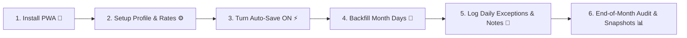

# 🍱 WRC Hostel Canteen Tracker 🇳🇵💖

<div align="center">

[](https://canteen-wrc.vercel.app/)
[](https://canteen-wrc.vercel.app/)
[-d97706?style=for-the-badge&logo=nepal&logoColor=white)](https://canteen-wrc.vercel.app/)
[](LICENSE)
[](https://github.com/jagdishsah126/Canteen/stargazers)

*“Where engineering rigor meets hostel camaraderie — never lose a single rupee or meal record again!”* 🍲✨

**A handcrafted, zero-cloud, 100% client-side Progressive Web App (PWA) tailored exclusively for the resident scholars of Paschimanchal Campus (WRC), Institute of Engineering (IOE), Tribhuvan University, Pokhara, Nepal.**

[**🌐 Open Live App**](https://canteen-wrc.vercel.app/) • [**📲 Installation Steps**](#-how-to-install-on-mobile-pwa) • [**🧭 User Guide**](#-step-by-step-user-walkthrough--guide) • [**✨ Features**](#-comprehensive-feature-suite) • [**🏛️ Architecture**](#-system-architecture--how-our-app-works) • [**📂 File Tree**](#-complete-file-tree--usage-catalog) • [**💬 Contact**](#-authors-craftsmen--support)

---

</div>

## 🌐 Live Web Application URL

The application is deployed with automated CI/CD and production asset precaching:

👉 **[https://canteen-wrc.vercel.app/](https://canteen-wrc.vercel.app/)** 👈

> ⚡ **No Sign-Up • Zero Ads • No Backend Tracking • 100% Offline Capable**  
> Everything stays safely within your phone’s local browser storage.

---

## 📲 How to Install on Mobile (PWA)

Turn **WRC Hostel Canteen Tracker** into an app on your smartphone with **no app store download** required!

```
 📱 Open URL in Mobile Browser  ──▶  Tap Browser Menu (⋮ or Share)  ──▶  Tap "Install" / "Add to Home Screen"  ──▶  🚀 Launch Offline Anytime!
```

<details open>
<summary><b>🤖 Android Users (Chrome, Brave, Edge, Samsung Internet)</b></summary>

1. Open **[https://canteen-wrc.vercel.app/](https://canteen-wrc.vercel.app/)** in Google Chrome or Brave.
2. Tap the **three vertical dots (⋮)** in the top-right corner of your browser.
3. Tap **"Install app"** or **"Add to Home Screen"**.
4. Confirm installation. The **WRC Canteen** icon will now appear in your app drawer and home screen.
5. *Enjoy instant full-screen access with zero browser address bar, running offline even in remote hostels or during internet outages!* 📡❌

</details>

<details open>
<summary><b>🍎 iPhone & iPad Users (Apple Safari)</b></summary>

1. Open **[https://canteen-wrc.vercel.app/](https://canteen-wrc.vercel.app/)** in **Safari**.
2. Tap the **Share button** (the square icon with an upward-pointing arrow `⬆️` at the bottom bar).
3. Scroll down and select **"Add to Home Screen"** (`➕`).
4. Tap **"Add"** in the top right.
5. The Canteen Tracker is now an independent iOS web app on your home screen!

</details>

<details>
<summary><b>💻 Desktop / Laptop Users (Chrome, Edge, Brave)</b></summary>

1. Open the URL in Chrome or Edge.
2. Look at the right side of the URL address bar for the **Install button** (or `⋮` ➔ *Save and Share* ➔ *Install WRC Hostel Canteen Tracker*).
3. Tap **Install** to enjoy a dedicated windowed desktop application experience.

</details>

---

## 🧭 Step-by-Step User Walkthrough & Guide

Here is the exact journey to ensure your mess ledger is always 100% accurate:



### 1️⃣ First Step: Launch & Install
Open [canteen-wrc.vercel.app](https://canteen-wrc.vercel.app/) and install it to your home screen using the steps above.

### 2️⃣ Configure Your Hostel Resident Profile & Rates
Navigate to the **Settings tab (⚙️)**:
- **Resident Profile**: Fill in your **Name**, **Room Number** (e.g. *214*), and **Hostel Block** (e.g. *Block B*). This auto-formats onto your monthly bill summary.
- **Canteen Prices**: Verify current WRC rates (Default: *Morning Food Rs. 72*, *Dinner Rs. 72*, *Masu Rs. 75*, *Omelette Rs. 30*). Adjust if mess rates change.
- **Customize Presets**: Add your favorite morning breakfast items (e.g. *Chowmein Rs. 50*, *Momo Rs. 100*, *Milk Tea Rs. 20*).

### 3️⃣ Customize & Toggle Removable Meals
Don't eat morning food or prefer tracking only dinner and snacks?
- Under **Settings ➔ Core Hostel Food Items**, toggle OFF any meal (Morning Food, Breakfast, Dinner, Masu, Omelette).
- Add custom options like *Afternoon Milk*, *Roti*, or *Fruit Bowl* with toggle, numeric stepper, or multi-choice preset types!

### 4️⃣ Master Auto-Save vs. Vacation Mode
- **Auto-Save ON (Default)**: You don't need to open the app every day! The intelligent catchup engine automatically populates intermediate days with your default preferences whenever you return.
- **Vacation Mode (Auto-Save OFF)**: Going home for Dashain, Tihar, or semester break? Simply toggle **Auto-Save Daily Defaults OFF** in Settings. The app stops auto-filling days while you are away!

### 5️⃣ Backfill Data for Past Days
- Navigate back through earlier days in the current Nepali month using the date arrows (`←`, `→`).
- Adjust whatever you ate.
- Tap **✓ Save Day** to permanently commit that past day into the monthly bill ledger.

### 6️⃣ Daily Exceptions & Day Notes
- Most days you don't even have to touch anything.
- If you ate outside (e.g., at *Lamachaur* or *Bagar*), skipped dinner, or mess was closed: open the app, toggle that meal OFF, and write a quick 1-line **Day Note** (*"Ate thukpa with friends at Lamachaur"*).

### 7️⃣ Monthly Bill Audit & Closing
- At month's end, switch to the **Monthly Summary tab (📊)**.
- Review your exact total bill, meal breakdown percentages, average cost per day, and unlocked **Hostel Badges**.
- Cross-check against the contractor's notice board sheet.
- Tap **Close Month** to lock in a timestamped snapshot of the bill.

---

## ✨ Comprehensive Feature Suite

| Category | Feature | Description |
| :--- | :--- | :--- |
| 🇳🇵 **Calendar** | **Bikram Sambat (BS) Engine** | Automatic conversion of UTC/Gregorian timestamps into genuine Nepali BS dates (*Bhadra 27, 2083*) with leap month adjustments. |
| 🍱 **Core Meals** | **Morning Food & Dinner** | One-tap toggle buttons for daily meals with immediate cost calculation. |
| 🥐 **Breakfast** | **Multi-Choice & Presets** | Instant presets (*Chowmein, Momo, Tea*) plus arbitrary custom food names and prices. Incomplete meal warnings if price is omitted. |
| 🍗 **Extra Items** | **Masu & Omelette Steppers** | Non-negative integer counters with large touch-friendly buttons for tracking non-veg portions. |
| 🛠️ **Custom Items** | **Infinite Custom Addons** | Create unlimited custom options: **Toggle** (*e.g. Milk*), **Quantity** (*e.g. Eggs*), or **Multi-Choice** (*e.g. Snacks*). |
| ⚙️ **Modularity** | **Removable Core Meals** | Any default core meal can be disabled if a resident follows a unique diet. |
| ⚡ **Automation** | **Auto-Save Catchup** | Background catchup engine fills untracked days with defaults automatically upon opening. |
| 🏖️ **Vacation** | **Vacation / Leave Mode** | Turning Auto-Save OFF freezes automatic logging during semester breaks or hostel leaves. |
| 📝 **Diary** | **Day Notes / Annotations** | 120-character day note field per record (*"Mess closed for holiday"*, *"Sick in room"*). |
| 👤 **Identity** | **Hostel Resident Profile** | Configurable resident Name, Room Number, and Block badge displayed on Home and Monthly Bills. |
| 📊 **Analytics** | **Food Spend Breakdown** | Multi-segment visual expense distribution bar (Lunch vs Dinner vs Breakfast vs Extras) and daily averages. |
| 🏆 **Gamification** | **Dynamic Hostel Badges** | Unlocked achievements: 🍗 *Masu Lover*, 🍳 *Omelette Fan*, 🌅 *Morning Regular*, 🌙 *Night Loyal*, 🥐 *Breakfast King*, 💰 *Budget Saver*, 👑 *Ledger Master*. |
| 🔔 **Reminders** | **Offline Meal Prompts** | 100% client-side `Notification` API reminders scheduled for Morning (09:30) and Evening (21:30). |
| 💰 **Accounting** | **Historical Price Freezing** | Updating meal prices in Settings alters ONLY future records; past bills remain mathematically frozen. |
| 📦 **Portability** | **JSON Backup & Restore** | 1-click export of complete records, presets, and settings with automated schema v5 migration. |
| 🌙 **Visuals** | **Theme & Dark Mode** | Seamless dark/light theme toggle with system accent persistence and high-contrast OLED support. |

---

## 🏛️ System Architecture & How Our App Works

```
┌─────────────────────────────────────────────────────────────────────────────┐
│                          USER INTERFACE LAYER                               │
│  [ Home Page ]          [ Monthly Summary ]          [ Settings & Presets ] │
│        │                        │                             │             │
│  • Date Header            • Billing Analytics           • Profile Editor    │
│  • Resident Badge         • Dynamic Badges              • Custom Options    │
│  • Meal Toggles           • Audit Trail                 • Rate Manager      │
│  • Day Notes              • Snapshot Closer             • Reminder Pickers  │
└───────────────┬─────────────────┬─────────────────────────────┬─────────────┘
                │                 │                             │
                ▼                 ▼                             ▼
┌─────────────────────────────────────────────────────────────────────────────┐
│                         APPLICATION CORE & STORE                            │
│                 Zustand Store (`wrc_hostel_canteen_store_v5`)               │
│                                                                             │
│   • Auto-Save Catchup Engine          • Schema Migration Handler (v1-v5)    │
│   • In-Memory Record Indexes          • Day Notes & Profile State           │
│   • Core Item Availability Flags      • Custom Options Registry             │
└───────────────┬───────────────────────────────────────────────┬─────────────┘
                │                                               │
        ┌───────┴───────────────┐                       ┌───────┴─────────────┐
        ▼                       ▼                       ▼                     ▼
┌───────────────┐       ┌───────────────┐       ┌───────────────┐     ┌───────────────┐
│ Nepali Date   │       │ Pure Billing  │       │ Analytics     │     │ Notification  │
│ Engine (BS)   │       │ Engine        │       │ Engine        │     │ Engine        │
│               │       │               │       │               │     │               │
│ Converts ISO  │       │ Computes day  │       │ Spending %    │     │ Offline local │
│ ↔ BS dates    │       │ costs, month  │       │ Badges unlock │     │ reminders     │
│ dynamically   │       │ totals & audit│       │ Daily averages│     │ via Web API   │
└───────┬───────┘       └───────┬───────┘       └───────┬───────┘     └───────┬───────┘
        │                       │                       │                     │
        └───────────────────────┼───────────────────────┘                     │
                                ▼                                             ▼
                ┌───────────────────────────────┐                     ┌───────────────┐
                │ Browser LocalStorage Cache    │                     │ Device Tray   │
                │ (Encrypted / JSON Persisted)  │                     │ Notifications │
                └───────────────────────────────┘                     └───────────────┘
```

### 🧠 Architectural Invariants & Guarantees
1. **Source of Truth Principle**: Raw records store the chosen item and frozen price per day. Calculated totals are never stored as mutable single numbers to eliminate drift.
2. **Date Decoupling**: Storage keys strictly use ISO `YYYY-MM-DD` strings for flawless chronologic comparison, while the presentation layer dynamically translates to Bikram Sambat (`nepali-date-converter`).
3. **No Unintentional Mutation**: Browsing past or future days renders in isolated draft state. Only explicitly clicking **✓ Save Day** commits draft changes to the persistent database.
4. **Resilient Offline Upgrades**: The store schema migration pipeline sequentially ingests historical payloads from schema versions `v1`, `v2`, `v3`, and `v4` into `v5` without erasing user data.

---

## 📂 Complete File Tree & Usage Catalog

Here is the exact blueprint of the codebase and the duty of every single file:

```text
Canteen/
├── public/
│   ├── apple-touch-icon.png       # High-res home screen icon for iOS devices
│   ├── favicon.svg                # Vector tab favicon & meal reminder badge
│   ├── guide.html                 # Standalone offline HTML onboarding guide
│   ├── pwa-192x192.png            # Standard PWA launcher icon
│   ├── pwa-512x512.png            # High-res splash screen PWA icon
│   └── support.html               # Standalone community & developer contact portal
├── scripts/
│   └── test-cases.ts              # Headless TypeScript automated test & regression suite
├── src/
│   ├── components/
│   │   ├── BreakfastSelector.tsx  # Quick-tap breakfast presets & custom price modal
│   │   ├── ConfirmModal.tsx       # Reusable safety dialog for deletions & data restore
│   │   ├── DailyTotalBar.tsx      # Sticky floating footer with live daily total Rs.
│   │   ├── DateHeader.tsx         # BS day navigator, today jumper & Save Day action
│   │   ├── GuideModal.tsx         # Interactive onboarding modal with 5-step tutorial
│   │   ├── MealToggle.tsx         # Accessible toggle card for Morning Food & Dinner
│   │   ├── MultiChoiceMealSelector.tsx # Multi-choice dropdown/selector for custom items
│   │   ├── Navigation.tsx         # Bottom tab bar (Home, Monthly Summary, Settings)
│   │   ├── QuantityControl.tsx    # Touch-friendly non-negative increment/decrement steppers
│   │   └── SupportModal.tsx       # 1-Month milestone modal with WhatsApp & GitHub links
│   ├── pages/
│   │   ├── Home.tsx               # Main daily logging dashboard & resident profile badge
│   │   ├── MonthlySummary.tsx     # Monthly audit trail, spend analytics & hostel badges
│   │   └── Settings.tsx           # Rate manager, custom options, profile & reminder configs
│   ├── store/
│   │   └── canteenStore.ts        # Zustand store (Schema v5) with persistence & migrations
│   ├── types/
│   │   ├── canteen.ts             # TypeScript interfaces for meals, profile, snapshots & options
│   │   └── nepali-date-converter.d.ts # Type definitions for Bikram Sambat converter
│   ├── utils/
│   │   ├── analytics.ts           # Spend percentages, daily averages & hostel badge algorithms
│   │   ├── billing.ts             # Pure billing engine & monthly aggregation calculations
│   │   ├── nepaliDate.ts          # Gregorian-to-BS converter, offsets & month range utilities
│   │   └── notifications.ts       # Pure offline browser Notification API helper
│   ├── App.tsx                    # Root component with dark mode, reminders timer & routing
│   ├── index.css                  # Global Tailwind CSS directives & custom scrollbars
│   ├── main.tsx                   # React 18 DOM mount point with PWA service worker registration
│   └── vite-env.d.ts              # Vite runtime client types
├── index.html                     # HTML5 entry with mobile viewport meta & PWA headers
├── package.json                   # Dependency definitions, build scripts & metadata
├── postcss.config.js              # PostCSS plugins for Tailwind CSS processing
├── tailwind.config.js             # Tailwind theme extensions, color palette & typography
├── tsconfig.json                  # Strict TypeScript compiler options (noUnusedLocals)
├── tsconfig.node.json             # TypeScript configuration for Vite configuration files
├── vite.config.ts                 # Vite bundler, PWA manifest generation & precaching config
├── Plan.md                        # Architectural specification, schema roadmap & design ledger
└── README.md                      # Comprehensive project documentation & user manual
```

---

## 🛠️ Local Development & Testing

### Prerequisites
- Node.js (v18.0.0 or later)
- npm / yarn / pnpm

### 1. Clone & Install
```bash
git clone https://github.com/jagdishsah126/Canteen.git
cd Canteen
npm install
```

### 2. Start Local Development Server
```bash
npm run dev
```
Open [http://localhost:5173](http://localhost:5173) in your browser.

### 3. Run Automated Validation Test Suite
Verify billing logic, BS date calculations, store actions, and analytics badges:
```bash
npx tsx scripts/test-cases.ts
```

### 4. Build for Production & PWA Inspection
```bash
npm run build
npm run preview
```

---

## 💬 Authors, Craftsmen & Support

This project was built with devotion, precision, and care for the hostel community:

* **Jagdish Sah**  
  🌐 Website: [jagdishsah.com.np](https://jagdishsah.com.np)  
  💬 WhatsApp: [+977 9702406668](https://wa.me/9779702406668?text=Hi%20Jagdish,%20regarding%20WRC%20Hostel%20Canteen%20Tracker)  
  🐙 GitHub: [@jagdishsah126](https://github.com/jagdishsah126)

* **💖Your Zara💖**  
  🐙 GitHub: [@YourZara](https://github.com/YourZara)  
  📧 Email: `foreverzaraa@gmail.com`

---

<div align="center">

### 🌟 If this app saved your hostel budget, please give our repository a Star! ⭐

**[Star on GitHub](https://github.com/jagdishsah126/Canteen)** • **[Submit an Idea / Bug Report](https://github.com/jagdishsah126/Canteen/issues/new)**

*WRC Hostel, Paschimanchal Campus, Pokhara • Built with 💖 for Nepali Students* 🇳🇵

</div>
